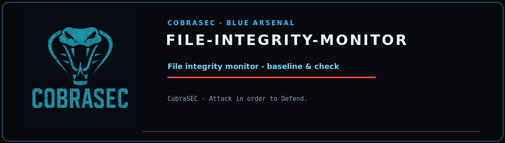

<p align="center">
  
</p>

<p align="center">
  
  
  
  
</p>

<h1 align="center">file-integrity-monitor</h1>
<p align="center"><b>Baseline & diff file integrity monitor</b><br><sub><i>CobraSEC · Attack in order to Defend.</i></sub></p>

---


Features:
  - Baseline generation: SHA256 hash of every tracked file + metadata
  - Real-time monitoring via inotify (Linux)
  - Periodic polling fallback with configurable interval
  - Tracks: content hash, permissions, owner, group, size, mtime, inode
  - Monitors: /etc, /bin, /sbin, /usr/bin, /usr/sbin, /lib, /boot, and custom paths
  - Excludes: /proc, /sys, /dev, /run, /tmp, logs, caches
  - Alert on: content change, permission change, ownership change, new SUID, deletion
  - SQLite + JSON baseline storage
  - Diff output showing exactly what changed
  - Email/webhook alerting support

Usage:
  python3 file_integrity_monitor.py --baseline     # Generate baseline
  python3 file_integrity_monitor.py --monitor        # Start monitoring
  python3 file_integrity_monitor.py --check          # One-time integrity check
  python3 file_integrity_monitor.py --diff           # Show changes since baseline

## Requirements

- Python 3.8+ (standard library only — no external dependencies)

## Usage

```
python3 file_integrity_monitor.py --help
```

```
usage: file_integrity_monitor.py [-h] [--baseline] [--check] [--monitor]
                                 [--diff] [--events [EVENTS]] [--db DB]
                                 [--output OUTPUT]

File Integrity Monitor

options:
  -h, --help         show this help message and exit
  --baseline         Generate integrity baseline
  --check            One-time integrity check
  --monitor          Real-time monitoring
  --diff             Same as --check with verbose output
  --events [EVENTS]  Show recent events
  --db DB            Database path
  --output OUTPUT    Export changes to JSON file
```

## Notes

- Defensive tooling: run only on systems you own or are authorized to assess.
- Read-only by design where possible; review flags before use on production hosts.
- Some checks (disk sectors, process memory, raw sockets) require root.
